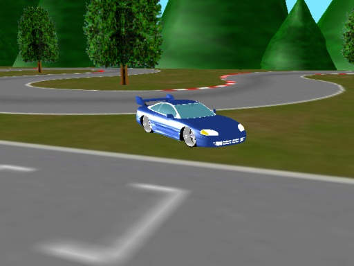



## SuperGT 3D racing game

### Description

SuperGT is a 3D racing game made with DirectX. You can drive a car around a track, and it keeps track of how many laps you have completed. A joystick/gamepad is supported.

All of the models except the car were made by me.

Please vote!
 
### More Info
 
Make sure you compile /Config/Config.vbp into /Config.exe to set the options.

             |
---                |---
**Submitted On**   |2003-04-21 14:42:38
**By**             |[Marshall H\.](https://github.com/Planet-Source-Code/PSCIndex/blob/master/ByAuthor/marshall-h.md)
**Level**          |Intermediate
**User Rating**    |5.0 (104 globes from 21 users)
**Compatibility**  |VB 5\.0, VB 6\.0
**Category**       |[DirectX](https://github.com/Planet-Source-Code/PSCIndex/blob/master/ByCategory/directx__1-44.md)
**World**          |[Visual Basic](https://github.com/Planet-Source-Code/PSCIndex/blob/master/ByWorld/visual-basic.md)
**Archive File**   |[SuperGT\_3D1698911242004\.zip](https://github.com/Planet-Source-Code/marshall-h-supergt-3d-racing-game__1-51215/archive/master.zip)

